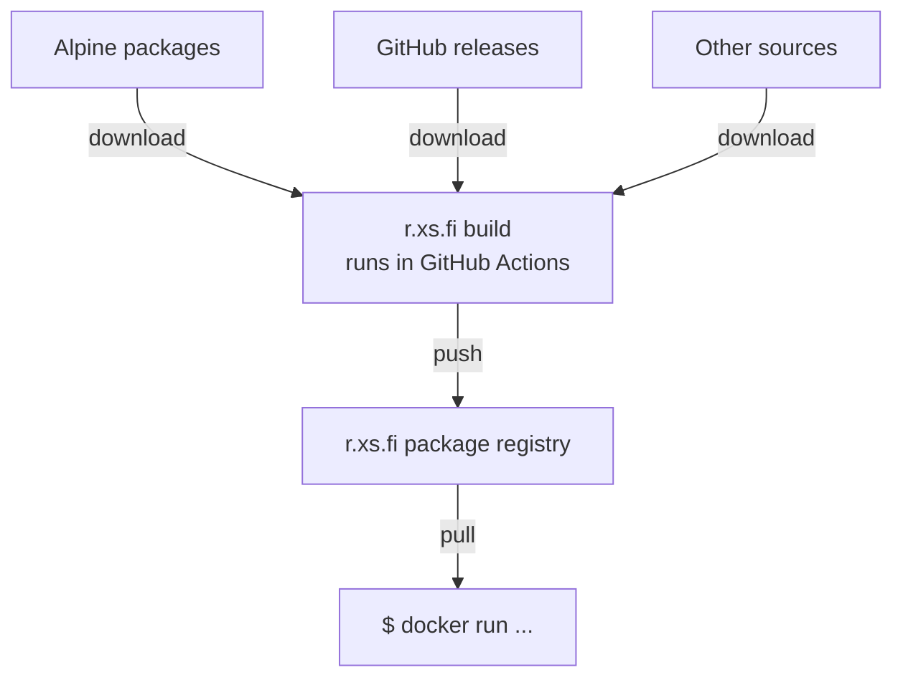

# Our manifesto

Only tiny percentage of software users are developers.

Most open source software have terrible or convoluted instructions on how to get the software running. Worse yet, many expect you to compile the software yourselves ("oh, the installation is easy when you have the build tools installed" ... who cares about the build tools or fighting mismatching versions!), and some of those even lack proper instructions on how to get it compiled.

The end result is the user deriving some benefit from the software - we want the ramp-up to that end result to be as frictionless as possible.

However miserable the compilation step is, we hide that behind a container-based build step and a nice standardized package comes out from the end of the pipeline.

The user only has to have Docker installed - that is the least amount of pain we have to settle for.

# Build process

With rare exceptions, most of our build processes look like this:

# Golden samples for packaging

How to package based on different circumstances (ready-made packages, build from source per programming language/etc...):

| Use case                           | Sample package                                                                 |
|------------------------------------|-------------------------------------------------------------------------------|
| Just take pre-built from Alpine-based package | [tokei](https://github.com/r-xs-fi/tokei/blob/main/Dockerfile) |
| Build from Go source               | [torrent](https://github.com/r-xs-fi/torrent/blob/main/Dockerfile)            |
| Build from Rust source             | [scooter](https://github.com/r-xs-fi/scooter/blob/main/Dockerfile)            |
